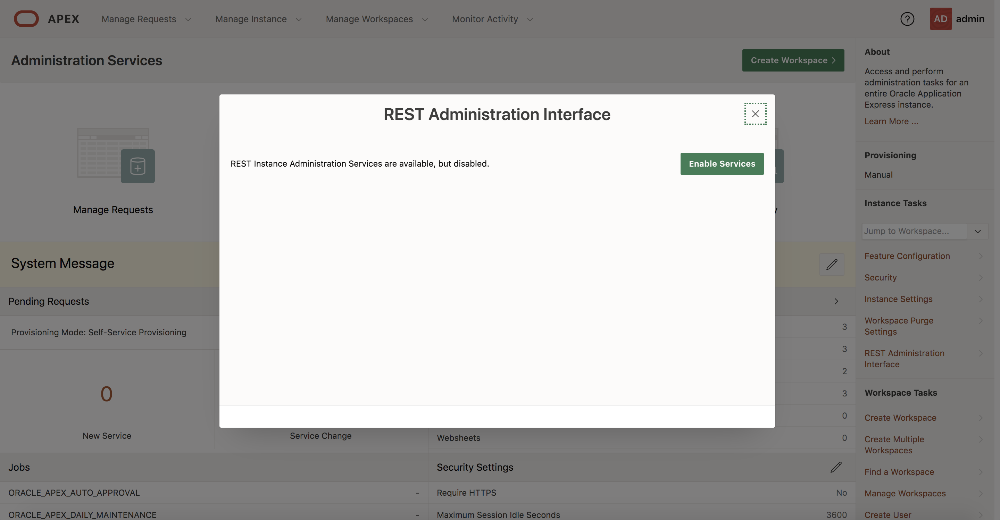
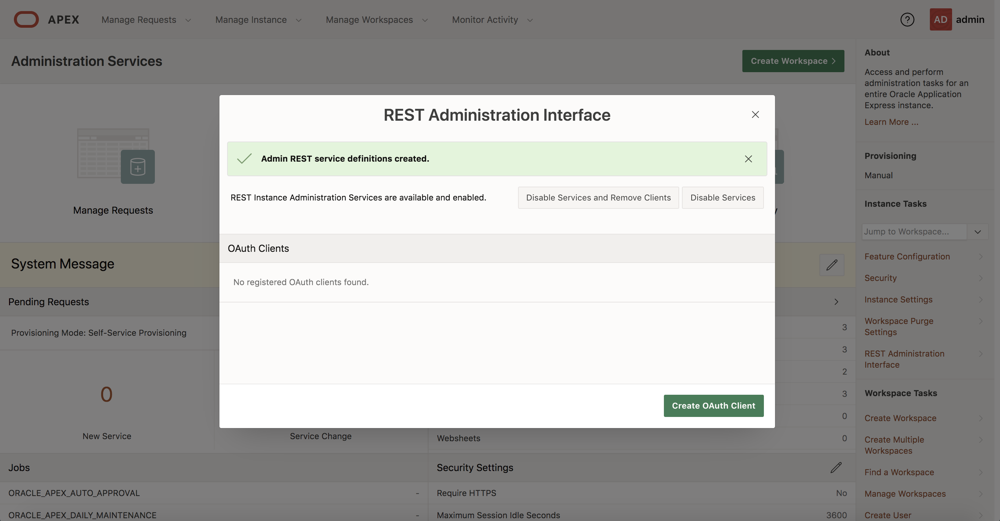
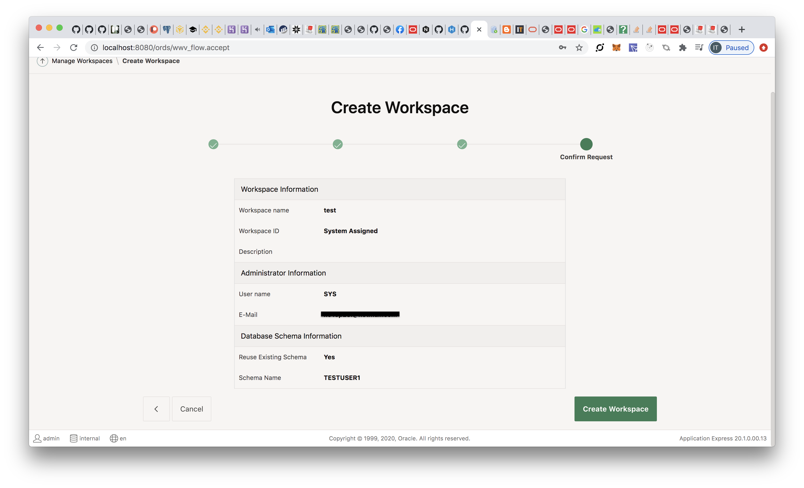

# ORDS

### Oracle APEX

[http://localhost:8080/ords/](http://localhost:8080/ords/)

Property | Value
-------- | -----
Workspace | INTERNAL
User | ADMIN
Password | OrclAPEX1999!

*If APEX Office Print is installed (INSTALL_AOP=true)*

Property | Value
-------- | -----
Workspace | AOP
User | ADMIN
Password | OrclAPEX1999!

### SQL Developer Web

*If SQL Developer Web is enabled (INSTALL_SQLDEVWEB=true)*

[http://localhost:8080/ords/sql-developer](http://localhost:8080/ords/sql-developer)

Property | Value
-------- | -----
User | SDW_ADMIN
Password | oracle

## Enable REST Administration Interface
透過 http://localhost:8080/ords/ -> 右側邊欄 REST Administration Interface -> 點選 enable service



```
sqlplus system/oracle@localhost/orcl
```

```
alter session set "_ORACLE_SCRIPT"=true;

drop user APEX_INSTANCE_ADMIN_USER;

alter session set "_ORACLE_SCRIPT"=false;

CREATE USER APEX_INSTANCE_ADMIN_USER IDENTIFIED BY oracle ACCOUNT UNLOCK;

grant create session to APEX_INSTANCE_ADMIN_USER;
```



## AutoREST

#### Create testuser1

You can replace `testuser1` to create another user
```
CREATE USER testuser1 IDENTIFIED BY testuser1 DEFAULT TABLESPACE users QUOTA UNLIMITED ON users;

GRANT CREATE SESSION, CREATE TABLE, CREATE PROCEDURE TO testuser1;
```

We have to use this command to connect to the database and exec SQL
```
CONN testuser1/testuser1@//localhost:1521/orcl
```

#### Create table

```
CREATE TABLE emp(  
  empno    number(4,0),  
  ename    varchar2(10 byte),  
  job      varchar2(9 byte),  
  mgr      number(4,0),  
  hiredate date,  
  sal      number(7,2),  
  comm     number(7,2),  
  deptno   number(2,0),  
  constraint pk_emp primary key (empno)
);
```

#### Insert record

```
INSERT INTO emp  
VALUES(  
 7839, 'KING', 'PRESIDENT', null,  
 to_date('17-11-1981','dd-mm-yyyy'),  
 5000, null, 10  
);

INSERT INTO emp  
VALUES(  
 7698, 'BLAKE', 'MANAGER', 7839,  
 to_date('1-5-1981','dd-mm-yyyy'),  
 2850, null, 30  
);

INSERT INTO emp  
VALUES(  
 7788, 'SCOTT', 'ANALYST', 7566,  
 to_date('13-JUL-87','dd-mm-rr') - 85,  
 3000, null, 20  
);
```

#### Enable path

```
BEGIN
  ORDS.enable_schema(
    p_enabled             => TRUE,
    p_schema              => 'testuser1',
    p_url_mapping_type    => 'BASE_PATH',
    p_url_mapping_pattern => 'hr',
    p_auto_rest_auth      => FALSE
  );
  COMMIT;
END;
```

```
BEGIN
  ORDS.DEFINE_MODULE(
    p_module_name => 'rest-v1',
    p_base_path   => 'rest-v1/'
  );
END;
```

```
BEGIN
  ORDS.enable_object (
    p_enabled      => TRUE,
    p_schema       => 'TESTUSER1',
    p_object       => 'EMP',
    p_object_type  => 'TABLE',
    p_object_alias => 'employees'
  );
    
  COMMIT;
END;
```

#### GET /employees (READ LIST)

```
## C
BEGIN
  ORDS.define_template(
    p_module_name     => 'rest-v1',
    p_pattern         => 'employees/'
  );
END;

BEGIN
  ORDS.DEFINE_HANDLER(
    p_module_name     => 'rest-v1',
    p_pattern         => 'employees/',
    p_method          => 'GET',
    p_source_type     => ords.source_type_collection_feed,
    p_source          => 'SELECT * FROM emp',
    p_items_per_page  => 0
  );
END;
```

#### GET /employees/{empno} (READ)

```
BEGIN
  ORDS.define_template(
    p_module_name     => 'rest-v1',
    p_pattern         => 'employees/:empno'
  );
END;

BEGIN
  ORDS.DEFINE_HANDLER(
    p_module_name     => 'rest-v1',
    p_pattern         => 'employees/:empno',
    p_method          => 'GET',
    p_source_type     => ords.source_type_collection_item,
    p_source          => 'SELECT * FROM emp WHERE empno = :empno'
  );
END;
```

#### POST /employees (CREATE)

```
CREATE OR REPLACE PROCEDURE create_employee (
  p_empno       IN emp.empno%TYPE,
  p_ename       IN emp.ename%TYPE,
  p_job         IN emp.job%TYPE, 
  p_mgr         IN emp.mgr%TYPE,
  p_hiredate    IN VARCHAR2,  
  p_sal         IN emp.sal%TYPE,
  p_comm        IN emp.comm%TYPE,
  p_deptno      IN emp.deptno%TYPE
) AS 
BEGIN
  INSERT INTO emp (empno, ename, job, mgr, hiredate, sal, comm, deptno)
  VALUES (p_empno, p_ename, p_job, p_mgr, p_hiredate, p_sal, p_comm, p_deptno);
EXCEPTION
  WHEN OTHERS THEN
    HTP.print(SQLERRM);
END;
```

```
BEGIN
  ORDS.DEFINE_HANDLER(
    p_module_name     => 'rest-v1',
    p_pattern         => 'employees/',
    p_method          => 'POST',
    p_mimes_allowed   => 'application/json',
    p_source_type     => ords.source_type_plsql,
    p_source          => 'BEGIN 
                            create_employee(
                              p_empno       => :empno,
                              p_ename       => :ename,
                              p_job         => :job, 
                              p_mgr         => :mgr,
                              p_hiredate    => :hiredate,  
                              p_sal         => :sal,
                              p_comm        => :comm,
                              p_deptno      => :deptno
                            );
                          END;'
  );
END;
```

#### PUT /employees/{empno} (UPDATE)

```
CREATE OR REPLACE PROCEDURE update_employee (
  p_empno       IN emp.empno%TYPE,
  p_ename       IN emp.ename%TYPE,
  p_job         IN emp.job%TYPE, 
  p_mgr         IN emp.mgr%TYPE,
  p_hiredate    IN VARCHAR2,  
  p_sal         IN emp.sal%TYPE,
  p_comm        IN emp.comm%TYPE,
  p_deptno      IN emp.deptno%TYPE
) AS 
BEGIN
  UPDATE emp 
  SET ename = p_ename, 
      job = p_job, 
      mgr = p_mgr, 
      hiredate = TO_DATE(p_hiredate), 
      sal = p_sal, 
      comm = p_comm, 
      deptno = p_deptno
  WHERE empno = p_empno;
EXCEPTION
  WHEN OTHERS THEN
    HTP.print(SQLERRM);
END;
```

```
BEGIN
  ORDS.DEFINE_HANDLER(
    p_module_name     => 'rest-v1',
    p_pattern         => 'employees/:empno',
    p_method          => 'PUT',
    p_mimes_allowed   => 'application/json',
    p_source_type     => ords.source_type_plsql,
    p_source          => 'BEGIN 
                            update_employee(
                              p_empno       => :empno,
                              p_ename       => :ename,
                              p_job         => :job, 
                              p_mgr         => :mgr,
                              p_hiredate    => :hiredate,  
                              p_sal         => :sal,
                              p_comm        => :comm,
                              p_deptno      => :deptno
                            );
                          END;'
  );
END;
```

#### DELETE /employees/{empno} (DELETE)

```
CREATE OR REPLACE PROCEDURE delete_employee (
  p_empno       IN emp.empno%TYPE
) AS 
BEGIN
  DELETE FROM emp WHERE empno = p_empno;
EXCEPTION
  WHEN OTHERS THEN
    HTP.print(SQLERRM);
END;
```

```
BEGIN
  ORDS.DEFINE_HANDLER(
    p_module_name     => 'rest-v1',
    p_pattern         => 'employees/:empno',
    p_method          => 'DELETE',
    p_source_type     => ords.source_type_plsql,
    p_source          => 'BEGIN 
                            delete_employee(
                              p_empno       => :empno
                            );
                          END;'
  );
END;
```

#### Check 

```
## list modules
SELECT id, name, uri_prefix FROM user_ords_modules ORDER BY name;

## list handlers
SELECT id, template_id, source_type, method, source FROM user_ords_handlers ORDER BY id;
```

#### Config ORDS workspace



#### API

- GET http://localhost:8080/ords/hr/rest-v1/employees/
- GET http://localhost:8080/ords/hr/rest-v1/employees/7788

## Reference
- https://blogs.oracle.com/apex/creating-a-crud-form-on-a-rest-service-with-apex-181
- https://www.oraclecloudadmin.com/2017/03/oracle-create-rest-enable.html
- https://k21academy.com/oracle-integration-cloud-service/how-to-use-oracle-rest-data-services-ords/
- https://docs.oracle.com/cd/E56351_01/doc.30/e87809/ORDS-reference.htm#AELIG90208
